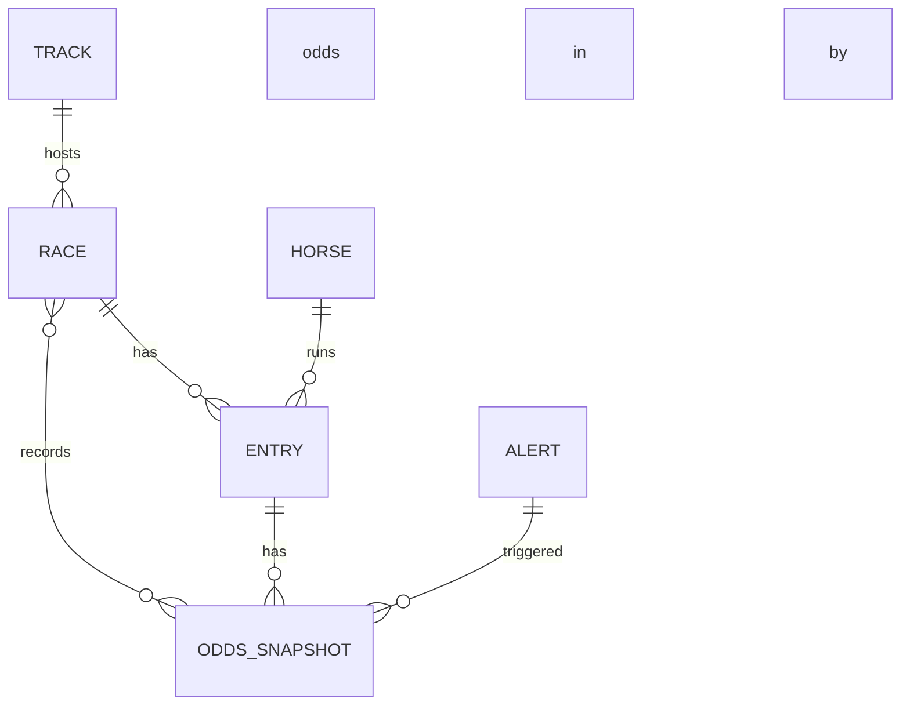

# Horse Racing Odds Tracking & Alert System Plan

> Docs: see [README](./README.md) • Guidelines: see [CLAUDE](./CLAUDE.md)

## Overview
This plan outlines a horse racing odds tracking and alert system for a solo developer on macOS using Python. The system continuously monitors pari-mutuel betting pools (e.g., Win and Exacta) for specified racetracks and notifies the user when certain conditions are met (such as odds thresholds or unusual betting patterns). Components include web scrapers for live odds data, a local SQLite database to store and analyze historical odds, an alert module for notifications (email), and an optional dashboard for visualizing odds trends.

## 🎯 Current Status: [IMPLEMENTED - Awaiting UAT]

### ✅ Completed Work (as of 2025-09-12)
- Drafted comprehensive architecture, data model, and implementation plan
- Defined conceptual ERD and provided initial SQL schema candidates
- Prepared example YAML config and example JSON payloads (Win and Exacta)
- **IMPLEMENTED all Phase 1 components**:
  - ✅ Python environment with all dependencies
  - ✅ SQLite database with full schema
  - ✅ Web scraper module with base and track scrapers
  - ✅ Configuration management system
  - ✅ Alert engine with evaluators
  - ✅ Email notification module
  - ✅ Main application with scheduler
- Created 7 comprehensive documentation issues (retroactively documenting completed work)
- System runs end-to-end with test data

### 📊 Metrics Summary
- **Scrape cadence**: TBD (target: 30–60s near post; 1–5m off-peak)
- **Alert latency**: TBD (target: < 15s after snapshot commit)
- **DB query latency**: TBD (target: < 100ms for latest odds/lookups with indices)

### 📋 Implementation Issues Created (2025-09-13)
1. **091325-1**: Project Setup and Environment Configuration (High/Beta Blocker)
2. **091325-2**: Database Schema and Models Implementation (High/Beta Blocker)
3. **091325-3**: Web Scraper Module Implementation (High/Beta Blocker)
4. **091325-4**: Configuration Management System (High/Beta Blocker)
5. **091325-5**: Alert Engine Implementation (High)
6. **091325-6**: Email Notification Module (Medium)
7. **091325-7**: System Integration and UAT Preparation (High/Beta Blocker)

## Phase Breakdown

### ✅ Phase 1: Foundations & Initial Scraper - [COMPLETED 2025-09-12]

#### Target Goals ✅ ACHIEVED
1. ✅ Finalize requirements, sources, and thresholds; set up macOS environment
2. ✅ Implement initial Win odds scraper for one track/source  
3. ✅ Create SQLite schema and verify insert/query paths
4. ✅ Introduce initial `config.yaml` driving the scraper

#### Completed Items
| Item | Before | After | Status |
|------|--------|-------|--------|
| Environment Setup | No Python env | Python 3.13.5, venv, all deps | ✅ Complete |
| Database | No database | SQLite with 7 tables, indices | ✅ Complete |
| Scraper Module | No scraper | Base + track scrapers implemented | ✅ Complete |
| Configuration | No config | YAML config system working | ✅ Complete |
| Alert Engine | No alerts | Threshold evaluators implemented | ✅ Complete |
| Notifications | No notifications | Email system with templates | ✅ Complete |
| Integration | Separate modules | Fully integrated with scheduler | ✅ Complete |

#### Implementation Status (All Completed)
| Issue | Component | Status | Notes |
|-------|-----------|--------|-------|
| 091325-1 | Project Setup | ✅ Implemented | Awaiting UAT |
| 091325-2 | Database Schema | ✅ Implemented | Tables created |
| 091325-3 | Web Scraper | ✅ Implemented | Base + samples |
| 091325-4 | Configuration | ✅ Implemented | YAML working |
| 091325-5 | Alert Engine | ✅ Implemented | Evaluators ready |
| 091325-6 | Notifications | ✅ Implemented | Email configured |
| 091325-7 | Integration/UAT | ✅ Implemented | System runs |

#### Results Achieved
- ✅ Development environment with Python 3.13.5, venv, and dependencies
- ✅ SQLite database with optimized schema and indices (7 tables)
- ✅ Working scraper framework with base and sample track scrapers
- ✅ Configuration-driven system behavior via YAML
- ✅ Alert evaluation with multiple evaluator types
- ✅ Email notification system with templates
- ✅ **System ready for UAT testing**

### 🔄 Phase 2: Multi-Source & Alert Logic - [Planned]

#### Target Goals
1. Extend scraper for multiple tracks/bet types (Win, Exacta)
2. Solidify data model; add exacta representation (table or JSON field)
3. Implement snapshot upsert/insert strategy without duplicating race/entry
4. Implement alert detection framework (console output for now)

#### Work Items
| Priority | Item | Complexity | Timeline | Status |
|----------|------|------------|----------|--------|
| High | Multi-track loop driven by YAML | Med | Week 2 | Planned |
| High | Exacta parsing and storage model | High | Week 2 | Planned |
| Medium | Alert evaluation functions (threshold checks) | Med | Week 2 | Planned |
| Medium | Snapshot index optimization | Low | Week 2 | Planned |

#### Data Sources & Scraper Strategy (Phase 2)
- Selected sources based on existing `BaseScraper` framework (`src/scraper/base.py`) and test track pattern:
  - Belmont Park (NYRA): `https://www.nyra.com/belmont`
  - Churchill Downs: `https://www.churchilldowns.com/racing/`
- Approach:
  - JSON-first: detect embedded JSON (e.g., `script[type="application/json"]`) or XHR endpoints discovered via network inspection.
  - HTML fallback: parse DOM with BeautifulSoup when JSON is unavailable.
  - Respect rate limiting via `BaseScraper._rate_limit` and retry logic.
- Track-specific scrapers to add in `src/scraper/tracks/`:
  - `BelmontScraper(BaseScraper)` (module: `tracks/belmont.py`)
  - `ChurchillDownsScraper(BaseScraper)` (module: `tracks/churchill_downs.py`)
- Example config mappings (proposed keys):
```yaml
tracks:
  - name: "Belmont Park"
    code: "BEL"
    url: "https://www.nyra.com/belmont"
    scraper: "belmont.BelmontScraper"
    enabled: true
    scrape_win: true
    scrape_exacta: true

  - name: "Churchill Downs"
    code: "CD"
    url: "https://www.churchilldowns.com/racing/"
    scraper: "churchill_downs.ChurchillDownsScraper"
    enabled: true
    scrape_win: true
    scrape_exacta: true
```
- Notes:
  - Exact JSON endpoints will be confirmed during implementation by inspecting network calls; the above URLs are stable entry points.
  - Exacta matrices can be large; prefer min/max summaries unless `store_full_matrix` is enabled.

### 📋 Phase 3: Notifications, Dashboard & Hardening - [Planned]

#### Target Goals
1. Integrate email notifications with SMTP (config-driven)
2. Suppress duplicate alerts and handle rate-of-change logic
3. Build dashboard (Flask/FastAPI or Streamlit) for odds, history, alerts
4. Optimize scraping (parallelism/async), DB writes, stability
5. Add tests and macOS background run setup (LaunchAgent)

## Implementation Strategy

### Week 1: Planning, Setup, and Basic Scraping
1. **Day 1-2**: Design & environment
   - Finalize requirements and system design (data model, sources, alert conditions)
   - Install Python 3.x and required libraries (pip/Homebrew)
   - Expected outcome: Stable local environment; agreed-upon architecture
2. **Day 3-4**: Initial scraper (Win)
   - Implement initial scraper for one source/track (Win odds)
   - Parse and normalize odds; validate parsing resilience
   - Expected outcome: JSON output for Win odds snapshots
3. **Day 5**: SQLite schema & config
   - Create tables for Track, Race, Entry, Odds; index on hot paths
   - Start simple `config.yaml` with one track
   - Expected outcome: Script stores Win odds to DB; prints/verifies output

### Week 2: Multi-Source Support and Data Model Completion
1. **Day 1-2**: Multi-track, multi-bet type
   - Extend scraper to multiple tracks from YAML; add Exacta probables
   - Decide exacta storage: separate table vs JSON field
   - Expected outcome: System loops configured tracks; handles Exacta
2. **Day 3-4**: DB consistency and alerts
   - Implement update strategy without duplicate races/entries
   - Add alert evaluation functions (threshold checks) with console output
   - Expected outcome: Console indicates would-be alerts
3. **Day 5**: Performance & indexing
   - Validate indices; test recent-snapshot queries
   - Expected outcome: Fast latest-odds lookups; clean logs

### Week 3: Alert Notifications & Refinement
1. **Day 1-2**: Email integration
   - Add SMTP settings to config; implement secure send via `smtplib`
   - Expected outcome: Test emails arrive for sample alerts
2. **Day 3-4**: Alert logic refinement
   - Add rate-of-change checks; dedup/suppress repeated alerts
   - Expected outcome: No duplicate emails during steady states
3. **Day 5**: End-to-end test & hardening
   - Run with real data; handle timeouts, retries, and logging
   - Expected outcome: Reliable scrape → store → detect → alert loop

### Week 4: Dashboard Integration and Final Touches
1. **Day 1-2**: Dashboard scaffold
   - Flask/FastAPI or Streamlit app showing live odds and alerts
   - Expected outcome: Real-time table; highlights alerting values
2. **Day 3-4**: Visualization & history
   - Add charts (Chart.js/Plotly or Streamlit widgets) for odds trends
   - Expected outcome: Usable visualization of trends
3. **Day 5**: Launch & polish
   - Add tests; parallelize/async scrape; batch DB writes; LaunchAgent
   - Expected outcome: Runs reliably in background on macOS

## Success Criteria

### Code Quality Metrics
- [ ] Strong input validation and exception handling in scrapers
- [ ] Config-driven behavior with schema-validated YAML
- [ ] Clear module boundaries; functions/classes with descriptive names
- [ ] Indices on `race_id`, `timestamp` for fast latest-snapshot queries

### Functional Requirements
- [ ] Scrape Win odds for configured tracks
- [ ] Scrape Exacta probables or derived stats (min/max, highlights)
- [ ] Persist snapshots with race/entry references in SQLite
- [ ] Evaluate thresholds and discrepancies; emit alerts
- [ ] Send email notifications with contextual details
- [ ] Dashboard displays live odds, alert highlights, and history

### Performance Targets
- [ ] Scrape cadence: 30–60s near post; 1–5m off-peak
- [ ] Latest odds query (indexed) < 100ms
- [ ] Alert delivery < 15s after snapshot commit
- [ ] Dashboard refresh < 2s for tracked races

## Risk Mitigation

### Potential Risks
1. **Source Volatility (HTML/JSON changes)**: Scrapers can break on site changes
   - **Mitigation**: Modular per-source scrapers, robust parsing, health checks
2. **Rate Limiting/Blocking**: Excessive requests can be throttled
   - **Mitigation**: Polite cadence, backoff, rotating user agents where appropriate
3. **Exacta Data Volume**: Full matrices can be large and frequent
   - **Mitigation**: Store summaries or on-demand matrix; JSON blobs near post time
4. **Email Deliverability**: SMTP auth or spam filtering issues
   - **Mitigation**: App passwords, TLS, configurable SMTP, optional dry-run mode

### Rollback Strategy
- Revert to previous working scraper version per source
- Disable Exacta storage; compute min/max in-memory only
- Switch email to log-only mode; queue/inspect unsent alerts
- Temporarily reduce track list or scrape cadence to stabilize

## Testing Strategy

### Unit Tests
- Parsing functions (HTML/JSON) with representative fixtures
- Odds conversion/normalization utilities (fractional/decimal)
- Alert threshold evaluation and dedup logic

### Integration Tests
- Scrape → parse → DB insert for a sample track end-to-end
- Config-driven runs across multiple tracks
- Email sending via test SMTP or mock server

### Performance Tests
- Benchmark scrape-to-store latency under multiple tracks
- DB read latency for latest snapshot queries at scale
- Dashboard load/refresh times under typical load

## Documentation Updates

### Required Updates
1. ERD and schema documentation (Mermaid + SQL)
2. Configuration guide for `config.yaml` (tracks, thresholds, email)
3. Runbook for macOS LaunchAgent/cron setup
4. Troubleshooting: scraping changes, blocking, email auth

## Next Steps

1. Set project structure and dependencies; initialize repo
2. Implement and verify initial Win odds scraper
3. Build SQLite schema migrations/setup scripts
4. Wire in alert evaluation against snapshots

## Notes

- Local single-user scope; avoid exposing dashboard publicly (or add basic auth)
- Adhere to scraping etiquette; use rate limiting/backoff
- Prefer structured endpoints (JSON) where available; fall back to HTML parsing

---

## Detailed Architecture & Design (Preserved Context)

### Features and Objectives
- Real-Time Odds Scraping: Periodically scrape live Win pool odds (win betting odds for each horse) and Exacta pool probable payoffs from official racing websites or APIs for specified tracks.
- Data Storage & Model: Store the scraped data in a structured SQLite database for historical analysis and quick retrieval. The database will include tables for tracks, races, horses (entries), odds, and alerts.
- Alert Logic: Evaluate incoming data against user-defined thresholds (e.g., odds dropping below a value, or payout exceeding a value) to identify valuable betting opportunities or significant pool changes. When conditions are met, send out email notifications to the user.
- Configurable Tracking: Use a `config.yaml` file for users to configure which tracks to monitor, what bet types (Win, Exacta, etc.) to track, and the threshold values or conditions for alerts, as well as email preferences.
- Dashboard Integration: Provide a simple dashboard or reporting interface to visualize current odds, historical trends, and alert history. This could be a lightweight web dashboard or integration with a tool that reads the SQLite data to display charts and tables in real-time.

The system is designed to be robust yet lightweight, suitable for running continuously on macOS. By leveraging Python’s scraping and data libraries and a local database, this project aims to give individual bettors an edge by catching odds movements or discrepancies between pools (e.g., a horse being heavily bet in exacta combinations but not in win pool) that might indicate hidden betting value.

### Data Model and Architecture
The system uses a relational schema (SQLite) to manage tracks, races, entries, odds, and alerts:



In this ERD:
- TRACK: `track_id`, `name`, and optional location/code
- RACE: `race_id`, `track_id`, `date`, `race_number`, metadata
- HORSE: `horse_id`, `name`
- ENTRY: `entry_id`, `race_id`, `horse_id`, `program_number`, `ml_odds`
- ODDS_SNAPSHOT: `snapshot_id`, `race_id`, `timestamp`, odds/pools per horse or JSON payloads for exotics
- ALERT: `alert_id`, `timestamp`, `race_id`/`entry_id`, `message`, `sent`

Notes:
- HORSE normalization is optional early on (can embed names in ENTRY)
- Store one row per horse per snapshot for Win odds; handle exotics separately or via JSON

### Sources for Odds Data (Scraping)
- Track websites/tote boards (HTML, sometimes with embedded JSON/XHR)
- Betting platforms or public providers (e.g., HKJC) where accessible
- Tools: Requests + BeautifulSoup; Selenium/Playwright when JS rendering is required
- Polite scraping with rate limiting and resilient parsers; prefer structured endpoints if available

#### Scraping Win Odds
Retrieve each horse’s win odds (fractional/decimal/implied probability) and Win pool amounts if available.

#### Scraping Exacta Probables
- Capture probable payouts for 1st→2nd ordered pairs; volume can be high
- Store extremes (min/max) or JSON blob; or persist full matrix near post time

#### Scheduling & Frequency
Use LaunchAgent/cron to run periodically; increase frequency near post.

### Technical Architecture
- Scraper Module: Fetch/parse odds; output normalized structures
- Database Module: Insert races/entries/snapshots; ensure indices
- Alert Module: Compare snapshots to thresholds; cross-pool discrepancies
- Notification Module: SMTP-based email with TLS (configurable)
- Dashboard Module: Flask/FastAPI or Streamlit showing live odds/history/alerts
- Configuration Management: Centralized `config.yaml`

#### Flow of Data
1. Initialization: Load config, initialize DB (create tables if not exist)
2. Scrape: For configured tracks, fetch odds; parse and normalize
3. Store: Upsert references; insert snapshot rows
4. Evaluate: Run alert checks vs thresholds/rate-of-change
5. Notify: Send email and log alert
6. Visualize: Dashboard reads DB periodically or on demand

### SQLite Database Schema (Candidate)

```sql
CREATE TABLE Track (
  track_id   INTEGER PRIMARY KEY,
  name       TEXT UNIQUE,
  code       TEXT
);
CREATE TABLE Race (
  race_id     INTEGER PRIMARY KEY,
  track_id    INTEGER REFERENCES Track(track_id),
  date        DATE,
  race_number INTEGER,
  status      TEXT
);
CREATE TABLE Horse (
  horse_id INTEGER PRIMARY KEY,
  name     TEXT
);
CREATE TABLE Entry (
  entry_id       INTEGER PRIMARY KEY,
  race_id        INTEGER REFERENCES Race(race_id),
  horse_id       INTEGER REFERENCES Horse(horse_id),
  program_number TEXT,
  ml_odds        REAL
);
CREATE TABLE OddsSnapshot (
  snapshot_id INTEGER PRIMARY KEY,
  race_id     INTEGER REFERENCES Race(race_id),
  fetched_at  DATETIME,
  horse_number TEXT,
  win_odds     REAL,
  win_pool     INTEGER,
  exacta_json  TEXT
);
CREATE TABLE Alert (
  alert_id     INTEGER PRIMARY KEY,
  triggered_at DATETIME,
  race_id      INTEGER,
  entry_id     INTEGER,
  message      TEXT,
  sent         BOOLEAN
);
```

If Exacta volume is high:

```sql
CREATE TABLE ExactaProbable (
  race_id    INTEGER,
  horse1     TEXT,
  horse2     TEXT,
  payout     REAL,
  fetched_at DATETIME
);
-- Composite PK could be (race_id, horse1, horse2, fetched_at)
```

### Dashboard & Visualization
- Live table of active races and odds; highlight alert-triggering values
- Optional exacta matrix or targeted combination lookup
- Historical charts for odds vs time per horse
- “Alerts Log” view from `Alert` table

### Sample Configuration File (`config.yaml`)

```yaml
# config.yaml

tracks:
  - "Belmont Park"
  - "Santa Anita Park"
  - "Churchill Downs"

bet_types:
  - Win        # Monitor Win pool odds
  - Exacta     # Monitor Exacta probable payouts

thresholds:
  win_odds_min: 2.0        # Alert if any horse's win odds go below 2.0
  win_odds_max: 10.0       # Alert if any horse's win odds go above 10.0
  exacta_min_payout: 50.0  # Alert if any exacta $2 payout falls below $50
  exacta_max_payout: 1000.0 # Alert if any exacta $2 payout exceeds $1000

email:
  enabled: true
  smtp_server: "smtp.gmail.com"
  smtp_port: 587
  use_tls: true
  sender: "odds.alert.bot@gmail.com"
  recipient: "user@example.com"
  smtp_username: "odds.alert.bot@gmail.com"
  smtp_password: "APPLICATION_SPECIFIC_PASSWORD"
```

Notes on Config:
- Track names should match scraper expectations; map to URLs/codes if needed
- Unsupported bet types can be ignored or added later
- Consider env vars for secrets instead of plain text

### Example Scraper Output (JSON)

Win pool odds snapshot:

```json
{
  "track": "Belmont Park",
  "date": "2025-09-12",
  "race": 5,
  "total_win_pool": 105000,
  "horses": [
    { "program_number": "1", "name": "Speedy Sam", "win_odds": "5-2", "win_odds_decimal": 2.5, "win_pool_amount": 25000 },
    { "program_number": "2", "name": "Luna Star", "win_odds": "3-5", "win_odds_decimal": 1.6, "win_pool_amount": 50000 },
    { "program_number": "3", "name": "Thunder Road", "win_odds": "12-1", "win_odds_decimal": 12.0, "win_pool_amount": 8000 },
    { "program_number": "4", "name": "Dark Horse", "win_odds": "8-1", "win_odds_decimal": 8.0, "win_pool_amount": 10000 },
    { "program_number": "5", "name": "Nightfall", "win_odds": "8-1", "win_odds_decimal": 8.0, "win_pool_amount": 10000 },
    { "program_number": "6", "name": "Red Rocket", "win_odds": "30-1", "win_odds_decimal": 30.0, "win_pool_amount": 2000 }
  ],
  "timestamp": "2025-09-12T18:30:00Z"
}
```

Exacta probables snapshot:

```json
{
  "track": "Belmont Park",
  "date": "2025-09-12",
  "race": 5,
  "total_exacta_pool": 75000,
  "exacta_probables": {
    "1-2": 45.0, "1-3": 300.0, "1-4": 250.0, "1-5": 250.0, "1-6": 800.0,
    "2-1": 50.0, "2-3": 320.0, "2-4": 280.0, "2-5": 290.0, "2-6": 900.0,
    "3-1": 310.0, "3-2": 310.0, "3-4": 1200.0, "3-5": 1300.0, "3-6": 3000.0,
    "4-1": 270.0, "4-2": 260.0, "4-3": 1250.0, "4-5": 800.0, "4-6": 2500.0,
    "5-1": 260.0, "5-2": 275.0, "5-3": 1300.0, "5-4": 780.0, "5-6": 2400.0,
    "6-1": 750.0, "6-2": 820.0, "6-3": 3500.0, "6-4": 2900.0, "6-5": 2700.0
  },
  "timestamp": "2025-09-12T18:30:00Z"
}
```

Interpretation:
- Smallest payout: 45.0 for 1-2; 50.0 for 2-1 (favorites pairing)
- Largest payouts in thousands (e.g., 6-3 at 3500.0), reflecting longshot combinations
- `exacta_min_payout: 50.0` → alert for 1-2 at $45; `exacta_max_payout: 1000.0` → alert for longest combos
- `total_exacta_pool` ($75,000) sums pool money; more money on a combo lowers payout

---

By implementing the above components step-by-step and following the phase breakdown, the solo developer will create a comprehensive odds tracking system. This system will empower the user to monitor betting markets in real time and react quickly to opportunities. With live odds and pool data and timely alerts via email, the user can make informed betting decisions and gain insight into wagering dynamics. The combination of Python-based web scraping, a relational database, and alerting logic represents a production-grade solution for tracking horse racing odds.

### References
- Parimutuel betting ties odds to pool money; win odds reflect win pool allocations.
- In absence of official APIs, scraping is effective; many projects store data in SQLite.
- Odds alerts mirror common sportsbook features, tailored here to pari-mutuel horse racing.
